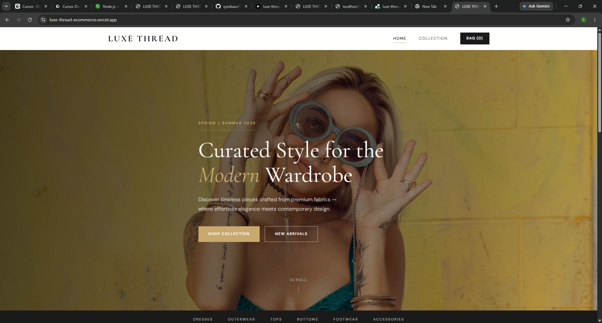
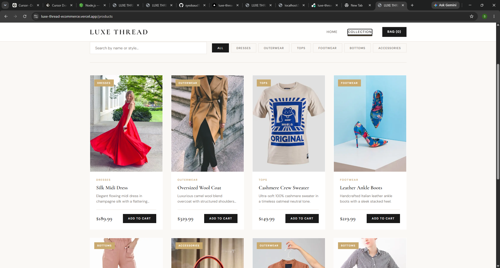
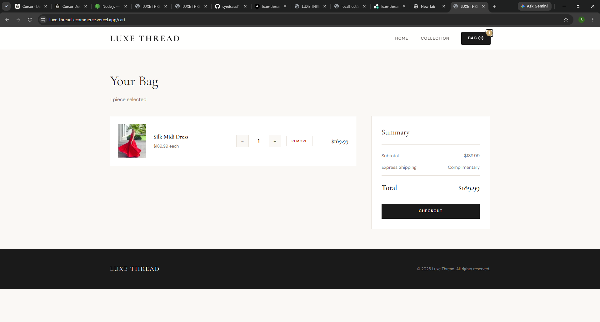

# 👗 LUXE THREAD

A modern luxury fashion e-commerce website built with **Next.js, Node.js, Express.js, and REST API**.

## 🌐 Live Demo

Frontend (Vercel)

https://luxe-thread-ecommerce.vercel.app

Backend API (Render)

https://luxe-thread-backend.onrender.com/api/products

---

# ✨ Features

- Modern Luxury Fashion UI
- Hero Landing Page
- Product Catalog
- Category Filtering
- Product Search
- Shopping Cart
- Quantity Management
- Remove From Cart
- Responsive Design
- REST API Integration
- Express Backend
- Next.js App Router
- TypeScript Support

---

# 🛠 Tech Stack

### Frontend

- Next.js
- React
- TypeScript
- CSS

### Backend

- Node.js
- Express.js

### Deployment

- Vercel
- Render

---

# 📁 Project Structure

```
luxe-thread-ecommerce
│
├── frontend
│   ├── app
│   ├── components
│   ├── context
│   ├── lib
│   └── styles
│
├── backend
│   ├── data
│   ├── server.js
│   └── package.json
│
└── README.md
```

---

# 🚀 Installation

Clone the repository

```bash
git clone https://github.com/syedsaud15/luxe-thread-ecommerce.git
```

Frontend

```bash
cd frontend
npm install
npm run dev
```

Backend

```bash
cd backend
npm install
npm start
```

---

# 🔗 API Endpoint

```
GET /api/products
```

Returns all available fashion products.

---

# 📱 Responsive Design

- Desktop
- Laptop
- Tablet
- Mobile

---

# 📷 Screenshots

## 📸 Screenshots

### 🏠 Home Page



---

### 🛍️ Products Page



---

### 🛒 Shopping Cart



---

# 🎯 Future Improvements

- User Authentication
- Wishlist
- Payment Gateway
- Order History
- Admin Dashboard
- Product Reviews

---

# 👨‍💻 Author

**Syed Saud Alam**

GitHub

https://github.com/syedsaud15

---

# ⭐ If you like this project, don't forget to star the repository.
